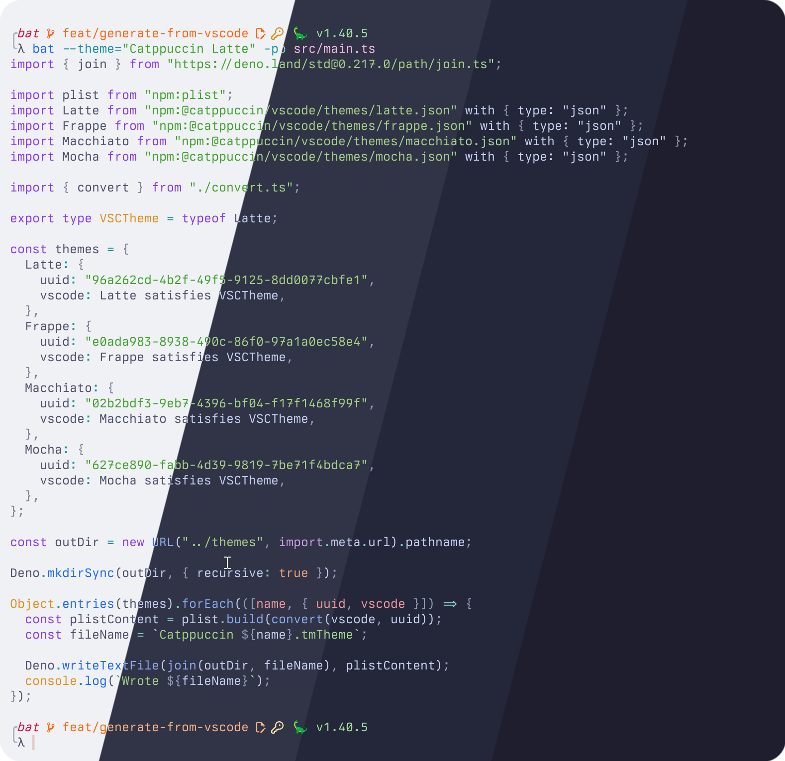
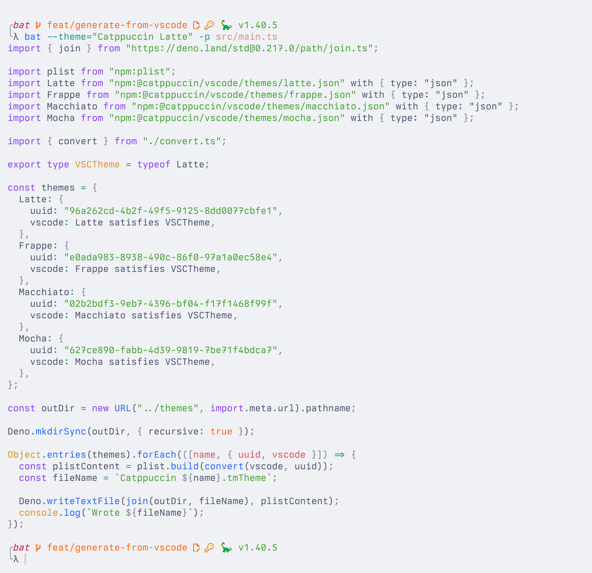
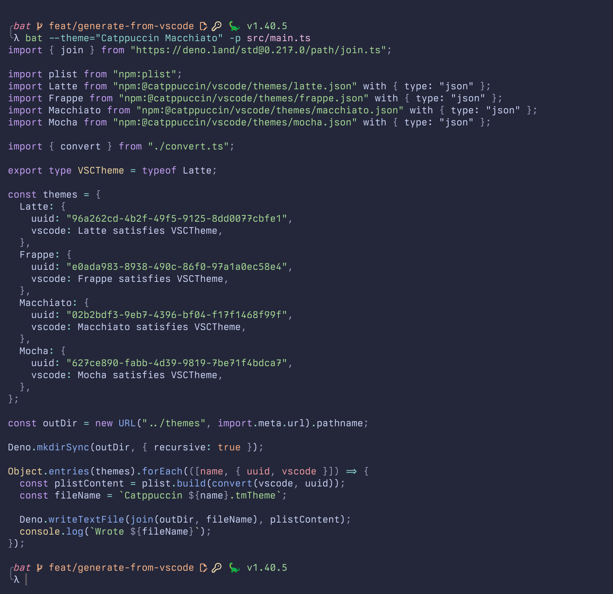
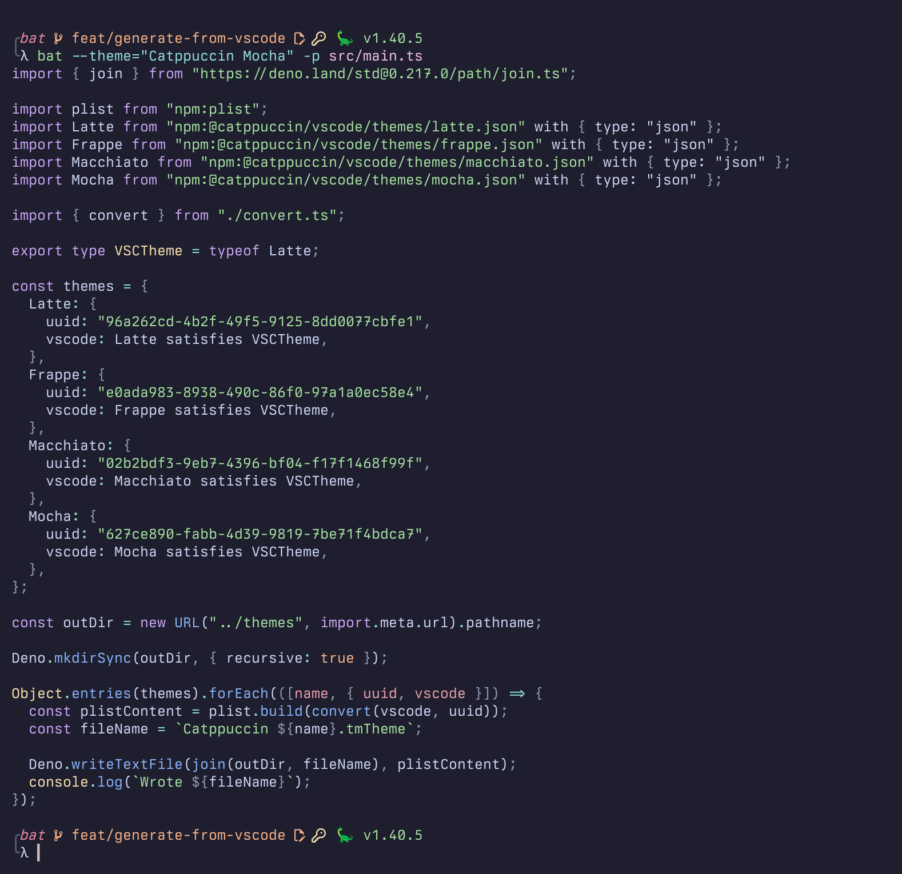

<h3 align="center">
	<br/>
	
	Catppuccin for <a href="https://github.com/sharkdp/bat">Bat</a>
	
</h3>

<p align="center">
	<a href="https://github.com/catppuccin/bat/stargazers"></a>
	<a href="https://github.com/catppuccin/bat/issues"></a>
	<a href="https://github.com/catppuccin/bat/contributors"></a>
</p>

<p align="center">
	
</p>

## Previews

<details>
<summary>🌻 Latte</summary>

</details>
<details>
<summary>🪴 Frappé</summary>

</details>
<details>
<summary>🌺 Macchiato</summary>

</details>
<details>
<summary>🌿 Mocha</summary>

</details>

## Adding the themes

1. Create a theme folder in bat's configuration directory by running:

```bash
mkdir -p "$(bat --config-dir)/themes"
```

3. Copy the theme files from this repository:

```bash
wget -P "$(bat --config-dir)/themes" https://github.com/catppuccin/bat/raw/main/themes/Catppuccin%20Latte.tmTheme
wget -P "$(bat --config-dir)/themes" https://github.com/catppuccin/bat/raw/main/themes/Catppuccin%20Frappe.tmTheme
wget -P "$(bat --config-dir)/themes" https://github.com/catppuccin/bat/raw/main/themes/Catppuccin%20Macchiato.tmTheme
wget -P "$(bat --config-dir)/themes" https://github.com/catppuccin/bat/raw/main/themes/Catppuccin%20Mocha.tmTheme
```

4. Rebuild bat's cache:

```bash
bat cache --build
```

5. Run `bat --list-themes`, and check if the themes are present in the list.

## Usage

There are two ways to get `bat` to default to Catppuccin:

### Configuration file

Edit your configuration file, located at `bat --config-file` (usually `~/.config/bat/config`):

```
--theme="Catppuccin Mocha"
```

### Environment variable

You can alternatively use the `BAT_THEME` environment variable. Export the environment variable inside your shell's configuration file: `BAT_THEME="Catppuccin Mocha"`.

The method to export the variable depends on your shell.

## 💝 Thanks to

- [ghostx31](https://github.com/ghostx31)
- [winston](https://github.com/nekowinston)

&nbsp;

<p align="center">
	
</p>

<p align="center">
	Copyright &copy; 2021-present <a href="https://github.com/catppuccin" target="_blank">Catppuccin Org</a>
</p>

<p align="center">
	<a href="https://github.com/catppuccin/catppuccin/blob/main/LICENSE"></a>
</p>
